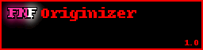

Tool for [Friday Night Funkin'](https://github.com/ninjamuffin99/Funkin) graphics modding written by zulc22, in Python.

This program is under the WTFPL. (See [LICENSE](LICENSE))

Previously, FNF graphics modding required good guesses, reading the XML files manually, or buying Adobe Animator for sprites not to jump around and get cut off.

No longer is this an issue! FNF Originizer visualizes the XML data and saves a cross-editor .ora format file, which will open in the following editors out of the box:

- MyPaint
- Krita
- GIMP
- Drawpile (Multiplayer Modding?!)
- Scribus

If your image editor of choice isn't in this list, GIMP can convert to other formats, most related ones being XCF (GIMP's native format), and PSD (Photoshop's native format), even though it isn't ideal.

If a Python library exists for the format you want, suggest it on the [Issues](https://github.com/zulc22/FNFOriginizer/issues) page.

Binaries can be found on the [Releases](https://github.com/zulc22/FNFOriginizer/releases) page.

## Details

`gui.py` contains all the GUI code, `cli.py` contains a VERY basic CLI for testing, and the `originizer` folder is a Python library that does all the actual hard work.

Run `python -m pip install -r requirements.txt` to install the **required libraries**.

Due to issues that aren't up to me to fix and don't know the specifics of, **Python versions after 3.7** are **UNABLE** to properly `pip install` Pillow or numpy (without the libraries not actually working), which are both required by this application. If you are a Linux user, no worries.

To build a Windows binary, install PyInstaller and run BUILD.bat.